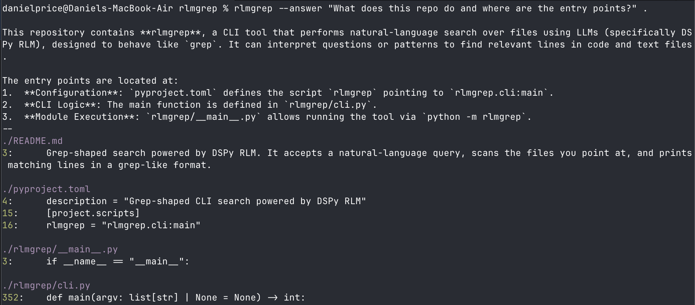
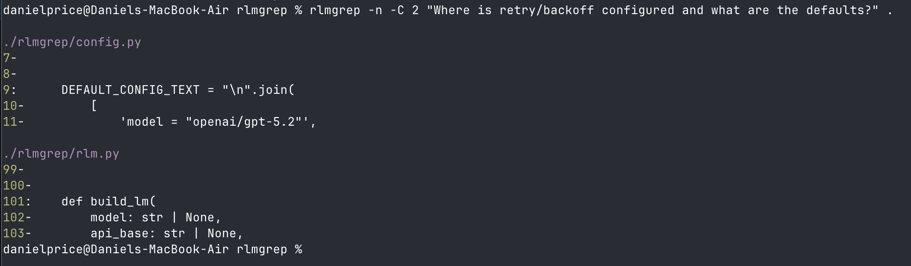

# rlmgrep

Grep-shaped search powered by DSPy RLM. It accepts a natural-language query, scans the files you point at, and prints matching lines in a grep-like format. Use `--answer` to get a narrative response grounded in the selected files/directories.

## Quickstart

```sh
uv tool install --python 3.11 rlmgrep
# or from GitHub:
# uv tool install --python 3.11 git+https://github.com/halfprice06/rlmgrep.git

export OPENAI_API_KEY=...  # or set keys in ~/.rlmgrep
```

```sh
rlmgrep --answer "What does this repo do and where are the entry points?" .
```



```sh
rlmgrep -C 2 "Where is retry/backoff configured and what are the defaults?" .
```



## Requirements

- Python 3.11+
- Deno runtime (DSPy RLM uses a Deno-based interpreter)
- API key for your chosen provider (OpenAI, Anthropic, Gemini, etc.)

## Non-text Files (PDF + Office + Media)

One of rlmgrep’s most useful features is that it can “grep” **PDFs and Office files** by converting them into text before the RLM search runs.

How it works:
- **PDFs** are parsed with `pypdf`. Each page gets a marker line like `===== Page N =====`, and output lines include a `page=N` suffix. Line numbers refer to the extracted text (not PDF coordinates).
- **Office & binary docs** (`.docx`, `.pptx`, `.xlsx`, `.html`, `.zip`, etc.) are converted to Markdown via **MarkItDown**. This happens during ingestion, so rlmgrep can search them like any other text file.
- **Images** can be described by a vision model and then searched through MarkItDown (OpenAI/Anthropic/Gemini), enable and configure in config.toml.
- **Audio** transcription is supported through OpenAI when enabled, configure in config.toml.

Sidecar caching:
- For images/audio, converted text is cached next to the original file as `<original>.<ext>.md` and reused on later runs.
- Use `-a/--text` if you want to treat binary files as raw text (UTF‑8 with replacement) and skip conversion.

## Install Deno

DSPy's default implementation of RLM requires the Deno runtime. Install it with the official scripts:

macOS/Linux:

```sh
curl -fsSL https://deno.land/install.sh | sh
```

Windows PowerShell:

```powershell
irm https://deno.land/install.ps1 | iex
```

Verify it is on your `PATH`:

```sh
deno --version
```

## Usage

```sh
rlmgrep [options] "query" [paths...]
```

Common options:

- `--answer` return a narrative answer before the grep output
- `-C N` context lines before/after (grep-style)
- `-A N` context lines after
- `-B N` context lines before
- `-m N` max matching lines per file
- `-g GLOB` include files matching glob (repeatable, comma-separated)
- `--type T` include file types (repeatable, comma-separated)
- `--hidden` include hidden files and directories
- `--no-ignore` do not respect `.gitignore`
- `--no-recursive` do not recurse directories
- `-a`, `--text` treat binary files as text
- `-y`, `--yes` skip file count confirmation
- `--files-from-stdin` treat stdin as newline-delimited file paths (e.g., `rg -l`)
- `--files-from-rg` alias for `--files-from-stdin`
- `--model`, `--sub-model` override model names
- `--api-key`, `--api-base`, `--model-type` override provider settings
- `--max-iterations`, `--max-llm-calls` cap RLM search effort
- `-v`, `--verbose` show verbose RLM output

Examples:

```sh
# Natural-language query over a repo
rlmgrep -C 2 "Where is retry/backoff configured and what are the defaults?" .

# Restrict to Python files
rlmgrep "Where do we parse JWTs and enforce expiration?" --type py .

# Glob filters (repeatable or comma-separated)
rlmgrep "How do we map external API errors into internal error codes?" -g "**/*.py" -g "**/*.ts" .

# Single-file semantic question (when you already have the file)
cat README.md | rlmgrep --answer "What is this tool for and how is it used?"

# Use rg/grep to find candidate files, then rlmgrep over that list
rg -l "token" . | rlmgrep --files-from-stdin --answer "What does this token control and where is it validated?"
```

## Input selection

- Directories are searched recursively by default. Use `--no-recursive` to stop recursion.
- Hidden files and ignore files (`.gitignore`, `.ignore`, `.rgignore`) are respected by default. Use `--hidden` or `--no-ignore` to include them.
- `--type` uses built-in type mappings (e.g., `py`, `js`, `md`); unknown values are treated as file extensions.
- `-g/--glob` matches path globs against normalized paths (forward slashes).
- Paths are printed relative to the current working directory when possible.
- If no paths are provided, rlmgrep reads from stdin and uses the synthetic path `<stdin>`; if stdin is empty, it exits with code 2.
- rlmgrep asks for confirmation when more than 200 files would be loaded (use `-y/--yes` to skip), and aborts when more than 1000 files would be loaded.

## Output contract (stable for agents)

- Matches are written to stdout; warnings go to stderr.
- Output uses rg-style headings by default:
  - A file header line like `./path/to/file`
  - Then `line:\ttext` for matches, `line-\ttext` for context lines
- Line numbers are always included and are 1-based.
- When context ranges are disjoint, a `--` line separates groups.
- Exit codes:
  - `0` = at least one match
  - `1` = no matches
  - `2` = usage/config/error


## Regex-style queries (best effort)

rlmgrep can interpret traditional regex-style patterns inside a natural-language prompt. The RLM may use Python (including `re`) in its internal REPL to approximate regex logic, but it is **not guaranteed** to behave exactly like `grep`/`rg`.

Example (best-effort regex semantics + extra context):

```sh
rlmgrep "Find Python functions that look like `def test_\\w+` and are marked as slow or flaky in nearby comments." .
```

If you need strict, deterministic regex behavior, use `rg`/`grep`.

## Configuration

rlmgrep creates a default config automatically if missing. The config path is:

- `~/.rlmgrep/config.toml`

Default config values (from `rlmgrep/config.py`):

```toml
model = "openai/gpt-5.2"
sub_model = "openai/gpt-5-mini"
api_base = "https://api.openai.com/v1"
model_type = "responses"
temperature = 1.0
max_tokens = 64000
max_iterations = 10
max_llm_calls = 20
file_warn_threshold = 200
file_hard_max = 1000
# markitdown_enable_images = false
# markitdown_image_llm_model = "gpt-5-mini"
# markitdown_image_llm_provider = "openai"
# markitdown_image_llm_api_key = ""
# markitdown_image_llm_api_base = ""
# markitdown_image_llm_prompt = ""
# markitdown_enable_audio = false
# markitdown_audio_model = "gpt-4o-mini-transcribe-2025-12-15"
# markitdown_audio_provider = "openai"
# markitdown_audio_api_key = ""
# markitdown_audio_api_base = ""
```

CLI flags override config values. Model keys are resolved as:

1) CLI flags (`--api-key`, `--sub-api-key`)
2) Config values (`api_key`, `sub_api_key`)
3) Provider env vars inferred from the model name:
   - `OPENAI_API_KEY`
   - `ANTHROPIC_API_KEY`
   - `GEMINI_API_KEY`

If more than one provider key is set and the model does not make the provider obvious, rlmgrep emits a warning and requires an explicit `--api-key`.

## Skill (Anthropic-style)

A ready-to-copy skill lives in:

- `skills/rlmgrep-usage/SKILL.md`

Install it by copying the folder into your agent’s skills directory (for example, `~/.claude/skills/rlmgrep-usage/`), then invoke it as `$rlmgrep-usage` in prompts. This is a lightweight, documentation-only skill meant to guide when to use rlmgrep vs `rg`/`grep`.

## Development

- Install locally: `pip install -e .` or `uv tool install .`
- Run: `rlmgrep "query" .`
- No test suite is configured yet.
